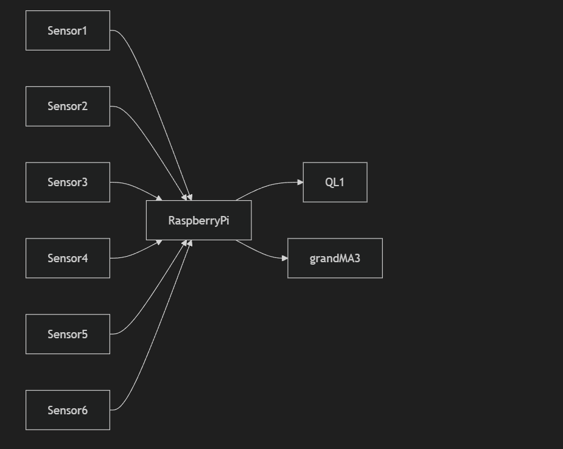

# EGL314 – Project Documentation

## Project Title
**Wall Glyphs: Silent Sequence**

## Introduction
This project involves the development of an immersive, non-verbal multiplayer game titled **Wall Glyphs: Silent Sequence**. The game is designed for 3 to 4 players who must collaborate to activate six wall-mounted glyphs in a specific sequence—without any verbal communication or visual cues.

## Objective
Players must replicate a pre-defined glyph activation sequence, demonstrated through a lighting display, by physically triggering pressure-sensitive stones in the correct order. The sequence must be completed within a set time limit after a spatial audio cue signals the start of the attempt.

## Dependencies
### hardware
- 1x Raspberry Pi 4 Model B
- 6x AoKu AK-399 Car seat pressure sensor
- 6x WAGO Connector
- 13x Jumper Wire
   
### Software
- Random Number Generator
- Sensor Signal Detector 

## System Diagram

## Code Logic
