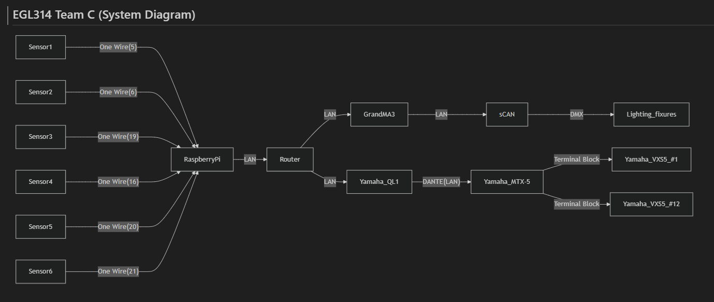

# 🎮 EGL314 – Project Documentation

## 🎯 Introduction

**Wall Glyphs: Silent Sequence** is an immersive, non-verbal multiplayer game designed for **3 to 4 players**. The objective? Collaborate **without speaking or using visual cues** to activate six glyphs on a wall in the correct order. 🤐✨

Players must rely solely on intuition and audio cues to work together and solve the sequence challenge!

---

## 🕹️ Objective

Players will:
- Observe a light-based demo of the correct glyph sequence 🔆
- Receive a **spatial audio signal** 🎧 to begin
- Step on **pressure-sensitive stones** 🪨 in the correct order
- Complete the sequence within a **set time limit** ⏱️


---

## 🔌 Dependencies

### 🛠️ Hardware
-  1x Raspberry Pi 4 Model B  
-  6x AoKu AK-399 Car Seat Pressure Sensors  
-  6x WAGO Connectors  
-  2x LAN cables
-  6x Carboard Button
-  1x Rasp Pi display V1
-  1x Display holder

### 💻 Software
-  Random Number Generator  
-  Sensor Signal Detector
---


## Physical connections and Props

Cabling
- 2x LAN cable

Since there are six sensors I needed twelve wires in total. I didn't want to use jumper wires as there would be too many points of failure over a long cable. I decided to use LAN cables by isolating two wires per sensor. Since a LAN cable only has four pairs and I needed six, I used two LAN cables.

Props
- Buttons
- Screen holder
- Prop Materials: Cardboard Glue 

We are using cardboard to make everything. For the buttons, we layered three pieces of cardboard and carved a shape into the top two layers to create a 3D effect. For the screen holder, I used glue and cardboard to make an angled piece of cardboard with a hole for the screen. 


## 🧭 System Diagram


---

## 💡 Code Logic

## 🎲 Random Number Generator - [Click Here](https://github.com/YHLeong/EGL314_TeamC/blob/main/Backlog%202%20sprint%201/RandomNumberGenerator_v4.py)
#### 🧾 Overview

This Python script continuously generates and prints sequences of random integers. Each sequence has a length that cycles through **4**, **8**, and **12**, refreshing every **1 second** until the user stops the script with **Ctrl+C**.

---

### 📚 Python Packages Used
```
import random
import time
```
#### 🎰random
Purpose: Used to generate random integers.
<br>
Function Used: random.randint(a, b) returns a random integer N such that a <= N <= b.

#### ⏰time
Purpose: Provides time-related functions. 
<br>
Function Used: time.sleep(seconds) pauses program execution for the given number of seconds.

### 🔄Index Tracker

```
sequence_lengths = [4, 8, 12]
current_index = 0  # Start at 4
```
- Tracks the current position in the sequence_lengths list.
- Initially set to 0, meaning the sequence will start with a length of 4.

### 🔁Main Loop
```
while True:
  ...
```
- An infinite loop (while True) is used to continuously generate sequences.
- The loop continues until the user stops it manually (e.g., with Ctrl+C).

### 🧮Sequence Generation
```
seq_length = sequence_lengths[current_index]
sequence = [random.randint(1, 6) for _ in range(seq_length)]
```
- Retrieves the current sequence length using the current_index.
- Generates a list of random integers between 1 and 6 (inclusive), simulating dice rolls.
- Uses list comprehension for concise generation.

### 📤Output
```
print(f"Generated sequence ({seq_length} numbers): {sequence}")
```
- Prints the generated sequence along with the number of elements.

### ➕Index Update
```
current_index = (current_index + 1) % len(sequence_lengths)
```
- Updates current_index to point to the next length in the list.
- Uses modulo (%) to cycle back to the start when the end is reached.

### ⏳Delay
```
time.sleep(1)
```
- Waits for 1 second before generating the next sequence.
- Helps maintain a steady interval between outputs.

### ✋Graceful Exit
```
except KeyboardInterrupt:
    print("\nExiting... Program stopped by user.")
```
- Allows the user to stop the program gracefully using Ctrl + C.
- Catches the KeyboardInterrupt exception and prints a message before exiting.
---

## Connection []()


## Prove Of Concept
### 🧾 Overview

This Python script implements a **progressive memory game** using a **Raspberry Pi** and **Tkinter GUI**. Players must memorize and replicate sequences shown on screen by pressing corresponding physical buttons connected via **GPIO pins**. The game consists of **multiple stages** with increasing sequence lengths, categorized into **Easy, Medium, and Hard** difficulty levels.


---

### 📚 Python Packages Used
```
import RPi.GPIO as GPIO             
import tkinter as tk                
import random                       
import time                         
import threading 
```
#### 📟 RPi.GPIO
Purpose: Interface with Raspberry Pi’s physical GPIO pins.

Used For: Configuring buttons as inputs and detecting button presses with debounce logic.

#### 🖼️ tkinter
- Purpose: Render and manage the GUI.
- Used For: Displaying sequences, sensor statuses, timers, and results dynamically.

#### 🎰 random
- Purpose: Sequence generation.
- Used For: `random.randint(1, 6)` to create a randomized pattern of sensor numbers.

#### ⏰ time
- Purpose: Sleep timing and debouncing.
- Used For: `time.sleep()`, `time.time()` to handle delays and debounce checks.

#### 🧵 threading
- Purpose: Keep GUI responsive while running game logic.    
- Used For: Running the main game function `(run_sequence_challenge)` in a separate thread.
---

### 🧭 GPIO Setup
```
SENSOR_MAP = {1: 17, 2: 6, 3: 19, 4: 16, 5: 20, 6: 21}
GPIO.setmode(GPIO.BCM)
for pin in SENSOR_MAP.values():
    GPIO.setup(pin, GPIO.IN, pull_up_down=GPIO.PUD_UP)
```
- Six sensors are mapped to GPIO pins.
- Input pins use pull-up resistors (active-low).
- BCM mode used for pin numbering.
---

### 🖥️ GUI Layout
```
root = tk.Tk()
root.title("Sensor Sequence Challenge")
```
- Main Window: Title set to "Sensor Sequence Challenge".

```
timer_label = tk.Label(...)  
sequence_label = tk.Label(...)  
result_label = tk.Label(...)  
labels_frame = tk.Frame(root)
```
- Timer Label: Shows time remaining for current stage.
- Sequence Label: Shows instructions and sequence step-by-step.
- Result Label: Displays success/failure feedback.
- Sensor Labels: Dynamically update with sensor states ("Pressed"/"Not Pressed").


---

### 🎮 Game Flow
```
steps_per_stage = [1, 2, 3, 4, 5, 6, 7, 9, 12]
difficulties = ["Easy", "Medium", "Hard"]
```
- Stages: 9 in total, increasing step complexity.
- Grouped into: 3 difficulty levels × 3 stages each.
  
### 🔢 Sequence Generation
```
full_sequence = [random.randint(1, 6) for _ in range(12)]
```
- A full 12-step random sequence is generated at the start and split across stages.

### 👁️ Displaying Sequence
```
def show_sequence_step_by_step(seq, length):
    def show_next(index):
        if index < length:
            sequence_label.config(text=f"Sequence Number {index + 1}: {seq[index]}")
            root.after(1000, show_next, index + 1)
        else:
            sequence_label.config(text=f"Repeat the first {length} steps using sensors!")
            start_sensor_monitoring()
    show_next(0)
```
- Displays the sequence one number per second using `root.after`.
- Informs the player when it's time to repeat the steps using sensors.
- Monitoring only starts after the full display finishes.

### 🧠 Sensor Monitoring
```
def update_sensor_status():
    if sensor_monitoring_enabled:
        current_time = time.time()
        sensor_press_count = {k: user_input.count(k) for k in SENSOR_MAP}

        for sensor_num, pin in sorted(SENSOR_MAP.items()):
            pin_state = GPIO.input(pin)
            status = "Pressed" if pin_state == GPIO.LOW else "Not Pressed"
            labels[sensor_num].config(text=f"Sensor {sensor_num} (Pin {pin}): {status}")

            was_pressed_before = last_pressed.get(pin, True)
            if was_pressed_before and pin_state == GPIO.LOW:
                last_time = last_press_time.get(pin, 0)
                if current_time - last_time > DEBOUNCE_DELAY:
                    if sensor_press_count.get(sensor_num, 0) < 2:
                        user_input.append(sensor_num)
                        last_press_time[pin] = current_time
                        if len(user_input) == len(current_sequence):
                            check_user_sequence()
            last_pressed[pin] = pin_state

        root.after(100, update_sensor_status)

```
- Polls GPIO pins every 100ms to detect button presses.
- Debounce protection: Only accepts inputs spaced by `DEBOUNCE_DELAY = 0.5` seconds.
- Press limit: Each sensor can only be pressed twice per round.
- Inputs get appended to `user_input` until it matches expected length.


### ✔️ Sequence Validation
```
def check_user_sequence():
    global sensor_monitoring_enabled
    sensor_monitoring_enabled = False
    cancel_round_timer()
    expected = current_sequence[:len(user_input)]
    if user_input == expected:
        result_label.config(text="✅ Correct sequence!", fg="green")
        sequence_completed.set()
    else:
        result_label.config(text=f"❌ Wrong sequence!\nExpected: {expected}\nYou: {user_input}", fg="red")
```
- Compares player input to the expected segment of the full sequence.
- Displays ✅ if correct, ❌ if wrong (with expected vs. actual).
- Ends stage on validation result.

### ⏱️ Countdown Timer
```
def start_timer(seq_length):
    total_time = TIMER_MAP.get(seq_length, 30)
    def countdown():
        nonlocal total_time
        while total_time > 0 and not sequence_completed.is_set():
            mins, secs = divmod(total_time, 60)
            timer_label.config(text=f" Time Left: {mins:02d}:{secs:02d}")
            time.sleep(1)
            total_time -= 1
        if not sequence_completed.is_set():
            timer_label.config(text=" Time's up!")
            timer_failed.set()
```
- The timer starts only after the sequence is shown.
- Counts down in real time and ends the round on timeout.
---

### 🧵 Threaded Execution
```
threading.Thread(target=run_sequence_challenge, daemon=True).start()
```
- Main game loop runs on a background thread.
- Keeps GUI responsive and prevents freezing during time delays or blocking calls.
---

### 🧩 Stage Logic
```
def play_stage(seq, stage_length):
    global current_sequence
    current_sequence = seq[:stage_length]
    sequence_completed.clear()

    root.after(0, lambda: sequence_label.config(text="Generating sequence..."))
    root.after(0, lambda: result_label.config(text=""))
    root.after(0, lambda: [label.config(text=f"Sensor {num} (Pin {pin}): Waiting...") for num, pin in SENSOR_MAP.items()])
    root.after(0, lambda: labels_frame.pack_forget())

    root.after(1000, lambda: show_sequence_step_by_step(current_sequence, stage_length))

    while not sequence_completed.is_set():
        time.sleep(0.1)

    return sequence_completed.is_set()
```
- Each stage resets labels and displays the assigned sequence portion.
- Waits for user to complete input or timeout.
- Returns whether the user passed the stage.
---

### 🚦 GUI Main Loop & Cleanup
```
try:
    root.mainloop()
finally:
    GPIO.cleanup()
```
- Main GUI loop keeps the window running.
- On exit (even via Ctrl+C), GPIO pins are reset properly to avoid hangups or damage.
---

### ✋ Graceful Exit
```
finally:
    GPIO.cleanup()
```
- Ensures all GPIO pins are released properly.
- Required for hardware stability and avoiding pin lockups after crash or forced quit.
- ---

## MVP
###
| Marker No. | REAPER Action      | Action ID |
|:----------:|:------------------:|:---------:|
| Marker 1   | Jump to Marker 01  | 40161     |
| Marker 2   | Jump to Marker 02  | 40162     |
| Marker 3   | Jump to Marker 03  | 40163     |
| Marker 4   | Jump to Marker 04  | 40164     |
| Marker 5   | Jump to Marker 05  | 40165     |
| Marker 6   | Jump to Marker 06  | 40166     |
| Marker 7   | Jump to Marker 07  | 40167     |
| Marker 8   | Jump to Marker 08  | 40168     |
| Marker 9   | Jump to Marker 09  | 40169     |
| Marker 10  | Jump to Marker 10  | 40170     |
| Marker 11  | Jump to Marker 11  | 40171     |
| Marker 12  | Jump to Marker 12  | 40172     |
| Marker 13  | Jump to Marker 13  | 40173     |
| Marker 14  | Jump to Marker 14  | 40174     |
| Marker 15  | Jump to Marker 15  | 40175     |
| Marker 16  | Jump to Marker 16  | 40176     |

