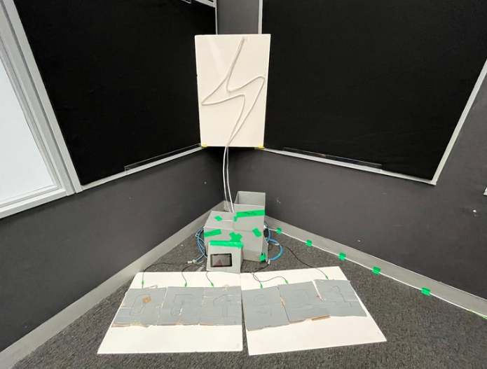

# EGL314 (Media Solutioning Project 1)

## 📂 Table of Contents
- [Introduction](#introduction)
- [Objective](#objective)
- [Dependencies](#dependencies)
    - [Hardware](#hardware)
    - [Software](#software)
- [Physical Connections and Props](#physical-connections-and-props)
- [System Diagram](#system-diagram)
- [Code Logic](#code-logic)
    - [Random Number Generator](#random-number-generator)
- [Prove of Concept](#prove-of-concept)
- [MVP](#mvp)
- [Final](#final)


---

# Introduction

**Galactic Charge-Up** is an immersive, non-verbal multiplayer game designed for **1 to 3 players**. The objective is to **step on pressure sensors** to charge all 4 battery before **time runs out**. 🤐✨

---

# Objective

Players will:
- Work together to charge all 4 batteries
- Step on **Charging pads** 🪨 untill battery is fully charged
- Complete charging each battery within a **set time limit** ⏱️

---

# Dependencies

## Hardware
-  1x Raspberry Pi 4 Model B  
-  6x OEM Pressure Sensors 
-  1x Neopixel (300 pixels) 
-  6x WAGO Connectors  
-  2x LAN cables
-  6x Carboard Button
-  1x Rasp Pi display V1
-  1x Display holder
-  1x Board (hold neopixel)
-  2x Holders for board
-  1x cardboard box to house electronics

## Software
-  OSC for Reaper and GrandMA3
-  Sensor Signal Detector
-  Timer
-  GUI
  
---

# Physical Connections and Props

Cabling
- 2x LAN cable

Since there are six sensors I needed twelve wires in total. I didn't want to use jumper wires as there would be too many points of failure over a long cable. I decided to use LAN cables by isolating two wires per sensor. Since a LAN cable only has four pairs and I needed six, I used two LAN cables.

Props
-  Buttons
-  Screen holder
-  Board for Neoopixel
-  Holders for Neopixel board
-  Box to house electronics

We are using cardboard to make everything. For the buttons, we layered two pieces of cardboard and carved numbers into the top two layers to create a 3D effect. I then inserted the sensor inbetween the pieces of cardboard.

For the screen holder, we used glue and cardboard to make an angled piece of cardboard with a hole for the screen. 

In our games story, we need a box to act as a power generator, we decided to use a painted cardboard box to hide our electronics.

For the Neopixel, we used nano tape to tape the neopixel to the board in a lightning pattern. We also made sure to leave some excess that could drop behind the box we are using to hide all the electronics.

Photos for reference:


<u>Buttons:</u>


We use 2 pieces of cardboard to sandwich the car seat sensor. On the top layer we carved out numbers 1 to 6. We then spray painted they grey
<br>
<br>
<u>Screen:</u>


We built a angled cardboard holder for the screen. This screen is used for the players and gamemaster to know the current state of the game
<br>
<br> 
<u>Neopixel & Board:</u>


This is our Neopixel. We mounted it on the board using nano tape in a lightning shape. Its a visual aid to allow the players and audience to know how close they are to winning
<br>
<br> 
<u>Box/Generator:</u>


This is the box we are using as our 'generator' and where we store our electronics. 
<br>
<br> 
<u>Station 2:</u>




# System Diagram


---

# Code Logic

## Random Number Generator - [Click Here](https://github.com/YHLeong/EGL314_TeamC/blob/main/Backlog%202%20sprint%201/RandomNumberGenerator_v4.py)
#### 🧾 Overview

This Python script continuously generates and prints sequences of random integers. Each sequence has a length that cycles through **4**, **8**, and **12**, refreshing every **1 second** until the user stops the script with **Ctrl+C**.

---

#### 📚 Python Packages Used
```
import random
import time
```
#### 🎰random
Purpose: Used to generate random integers.
<br>
Function Used: random.randint(a, b) returns a random integer N such that a <= N <= b.

#### ⏰time
Purpose: Provides time-related functions. 
<br>
Function Used: time.sleep(seconds) pauses program execution for the given number of seconds.

#### 🔄Index Tracker

```
sequence_lengths = [4, 8, 12]
current_index = 0  # Start at 4
```
- Tracks the current position in the sequence_lengths list.
- Initially set to 0, meaning the sequence will start with a length of 4.

#### 🔁Main Loop
```
while True:
  ...
```
- An infinite loop (while True) is used to continuously generate sequences.
- The loop continues until the user stops it manually (e.g., with Ctrl+C).

#### 🧮Sequence Generation
```
seq_length = sequence_lengths[current_index]
sequence = [random.randint(1, 6) for _ in range(seq_length)]
```
- Retrieves the current sequence length using the current_index.
- Generates a list of random integers between 1 and 6 (inclusive), simulating dice rolls.
- Uses list comprehension for concise generation.

#### 📤Output
```
print(f"Generated sequence ({seq_length} numbers): {sequence}")
```
- Prints the generated sequence along with the number of elements.

#### ➕Index Update
```
current_index = (current_index + 1) % len(sequence_lengths)
```
- Updates current_index to point to the next length in the list.
- Uses modulo (%) to cycle back to the start when the end is reached.

#### ⏳Delay
```
time.sleep(1)
```
- Waits for 1 second before generating the next sequence.
- Helps maintain a steady interval between outputs.

#### ✋Graceful Exit
```
except KeyboardInterrupt:
    print("\nExiting... Program stopped by user.")
```
- Allows the user to stop the program gracefully using Ctrl + C.
- Catches the KeyboardInterrupt exception and prints a message before exiting.
---

<br>
<br>


---

# Prove of Concept

Prove of Concept - [Click Here](./POC/)
#### 🧾 Overview

This Python script implements a **progressive memory game** using a **Raspberry Pi** and **Tkinter GUI**. Players must memorize and replicate sequences shown on screen by pressing corresponding physical buttons connected via **GPIO pins**. The game consists of **multiple stages** with increasing sequence lengths, categorized into **Easy, Medium, and Hard** difficulty levels.


---

#### 📚 Python Packages Used
```
import RPi.GPIO as GPIO             
import tkinter as tk                
import random                       
import time                         
import threading 
```
#### 📟 RPi.GPIO
Purpose: Interface with Raspberry Pi’s physical GPIO pins.

Used For: Configuring buttons as inputs and detecting button presses with debounce logic.

#### 🖼️ tkinter
- Purpose: Render and manage the GUI.
- Used For: Displaying sequences, sensor statuses, timers, and results dynamically.

#### 🎰 random
- Purpose: Sequence generation.
- Used For: `random.randint(1, 6)` to create a randomized pattern of sensor numbers.

#### ⏰ time
- Purpose: Sleep timing and debouncing.
- Used For: `time.sleep()`, `time.time()` to handle delays and debounce checks.

#### 🧵 threading
- Purpose: Keep GUI responsive while running game logic.    
- Used For: Running the main game function `(run_sequence_challenge)` in a separate thread.
---

### 🧭 GPIO Setup
```
SENSOR_MAP = {1: 17, 2: 6, 3: 19, 4: 16, 5: 20, 6: 21}
GPIO.setmode(GPIO.BCM)
for pin in SENSOR_MAP.values():
    GPIO.setup(pin, GPIO.IN, pull_up_down=GPIO.PUD_UP)
```
- Six sensors are mapped to GPIO pins.
- Input pins use pull-up resistors (active-low).
- BCM mode used for pin numbering.
---

### 🖥️ GUI Layout
```
root = tk.Tk()
root.title("Sensor Sequence Challenge")
```
- Main Window: Title set to "Sensor Sequence Challenge".

```
timer_label = tk.Label(...)  
sequence_label = tk.Label(...)  
result_label = tk.Label(...)  
labels_frame = tk.Frame(root)
```
- Timer Label: Shows time remaining for current stage.
- Sequence Label: Shows instructions and sequence step-by-step.
- Result Label: Displays success/failure feedback.
- Sensor Labels: Dynamically update with sensor states ("Pressed"/"Not Pressed").


---

### 🎮 Game Flow
```
steps_per_stage = [1, 2, 3, 4, 5, 6, 7, 9, 12]
difficulties = ["Easy", "Medium", "Hard"]
```
- Stages: 9 in total, increasing step complexity.
- Grouped into: 3 difficulty levels × 3 stages each.
  
### 🔢 Sequence Generation
```
full_sequence = [random.randint(1, 6) for _ in range(12)]
```
- A full 12-step random sequence is generated at the start and split across stages.

### 👁️ Displaying Sequence
```
def show_sequence_step_by_step(seq, length):
    def show_next(index):
        if index < length:
            sequence_label.config(text=f"Sequence Number {index + 1}: {seq[index]}")
            root.after(1000, show_next, index + 1)
        else:
            sequence_label.config(text=f"Repeat the first {length} steps using sensors!")
            start_sensor_monitoring()
    show_next(0)
```
- Displays the sequence one number per second using `root.after`.
- Informs the player when it's time to repeat the steps using sensors.
- Monitoring only starts after the full display finishes.

### 🧠 Sensor Monitoring
```
def update_sensor_status():
    if sensor_monitoring_enabled:
        current_time = time.time()
        sensor_press_count = {k: user_input.count(k) for k in SENSOR_MAP}

        for sensor_num, pin in sorted(SENSOR_MAP.items()):
            pin_state = GPIO.input(pin)
            status = "Pressed" if pin_state == GPIO.LOW else "Not Pressed"
            labels[sensor_num].config(text=f"Sensor {sensor_num} (Pin {pin}): {status}")

            was_pressed_before = last_pressed.get(pin, True)
            if was_pressed_before and pin_state == GPIO.LOW:
                last_time = last_press_time.get(pin, 0)
                if current_time - last_time > DEBOUNCE_DELAY:
                    if sensor_press_count.get(sensor_num, 0) < 2:
                        user_input.append(sensor_num)
                        last_press_time[pin] = current_time
                        if len(user_input) == len(current_sequence):
                            check_user_sequence()
            last_pressed[pin] = pin_state

        root.after(100, update_sensor_status)

```
- Polls GPIO pins every 100ms to detect button presses.
- Debounce protection: Only accepts inputs spaced by `DEBOUNCE_DELAY = 0.5` seconds.
- Press limit: Each sensor can only be pressed twice per round.
- Inputs get appended to `user_input` until it matches expected length.


### ✔️ Sequence Validation
```
def check_user_sequence():
    global sensor_monitoring_enabled
    sensor_monitoring_enabled = False
    cancel_round_timer()
    expected = current_sequence[:len(user_input)]
    if user_input == expected:
        result_label.config(text="✅ Correct sequence!", fg="green")
        sequence_completed.set()
    else:
        result_label.config(text=f"❌ Wrong sequence!\nExpected: {expected}\nYou: {user_input}", fg="red")
```
- Compares player input to the expected segment of the full sequence.
- Displays ✅ if correct, ❌ if wrong (with expected vs. actual).
- Ends stage on validation result.

### ⏱️ Countdown Timer
```
def start_timer(seq_length):
    total_time = TIMER_MAP.get(seq_length, 30)
    def countdown():
        nonlocal total_time
        while total_time > 0 and not sequence_completed.is_set():
            mins, secs = divmod(total_time, 60)
            timer_label.config(text=f" Time Left: {mins:02d}:{secs:02d}")
            time.sleep(1)
            total_time -= 1
        if not sequence_completed.is_set():
            timer_label.config(text=" Time's up!")
            timer_failed.set()
```
- The timer starts only after the sequence is shown.
- Counts down in real time and ends the round on timeout.
---

### 🧵 Threaded Execution
```
threading.Thread(target=run_sequence_challenge, daemon=True).start()
```
- Main game loop runs on a background thread.
- Keeps GUI responsive and prevents freezing during time delays or blocking calls.
---

### 🧩 Stage Logic
```
def play_stage(seq, stage_length):
    global current_sequence
    current_sequence = seq[:stage_length]
    sequence_completed.clear()

    root.after(0, lambda: sequence_label.config(text="Generating sequence..."))
    root.after(0, lambda: result_label.config(text=""))
    root.after(0, lambda: [label.config(text=f"Sensor {num} (Pin {pin}): Waiting...") for num, pin in SENSOR_MAP.items()])
    root.after(0, lambda: labels_frame.pack_forget())

    root.after(1000, lambda: show_sequence_step_by_step(current_sequence, stage_length))

    while not sequence_completed.is_set():
        time.sleep(0.1)

    return sequence_completed.is_set()
```
- Each stage resets labels and displays the assigned sequence portion.
- Waits for user to complete input or timeout.
- Returns whether the user passed the stage.
---

### 🚦 GUI Main Loop & Cleanup
```
try:
    root.mainloop()
finally:
    GPIO.cleanup()
```
- Main GUI loop keeps the window running.
- On exit (even via Ctrl+C), GPIO pins are reset properly to avoid hangups or damage.
---

### ✋ Graceful Exit
```
finally:
    GPIO.cleanup()
```
- Ensures all GPIO pins are released properly.
- Required for hardware stability and avoiding pin lockups after crash or forced quit.
- ---

<br>
<br>


---

# MVP - [Click Here](./MVP/)

### 🧾 Overview

This Python script implements an **interactive light-up game** using a **Raspberry Pi 4** with **WS281x LED strips**, **OSC communication**, and **Tkinter GUI**. Players must reach specific milestones by activating sensors while lights progressively fill up. The game integrates with **REAPER audio software** and **GrandMA3 lighting console** for immersive audio-visual feedback across **4 progressive difficulty levels**.

---

## 📚 Python Packages Used
```python
import time
import threading
import tkinter as tk
from rpi_ws281x import *
from pythonosc import udp_client, dispatcher, osc_server
```

#### ⏰ time
- Purpose: Timing controls and delays
- Used For: `time.time()` for elapsed time tracking, `time.sleep()` for LED animations

#### 🧵 threading
- Purpose: Multi-threaded execution
- Used For: Running OSC server, game logic, and GUI simultaneously without blocking

#### 🖼️ tkinter
- Purpose: GUI interface
- Used For: Displaying game status, level info, timer, and results in fullscreen mode

#### 💡 rpi_ws281x
- Purpose: Control addressable LED strips
- Used For: 300-LED strip animations, progress visualization, and stage feedback

#### 📡 pythonosc
- Purpose: OSC (Open Sound Control) communication
- Used For: Bidirectional communication with REAPER audio and GrandMA3 lighting

---

## 🌐 Network Setup
```python
GMA_IP, GMA_PORT       = "192.168.254.213", 2000  # GrandMA3 Console
REAPER_IP, REAPER_PORT = "192.168.254.12", 8000   # REAPER Audio
LOCAL_IP, LOCAL_PORT   = "192.168.254.108", 8001  # Game Controller
```
- **GrandMA3**: Receives lighting cue commands
- **REAPER**: Receives audio marker triggers and playback control
- **Local**: Listens for sensor input via OSC messages

## 🎵 REAPER Audio Control Functions - *Developed by Yu Hang*

#### 🧾 Overview

These Python functions provide a **comprehensive OSC-based interface** for controlling **REAPER audio software** from the Raspberry Pi game controller. The system handles **marker navigation**, **audio playback control**, and **automated timing sequences** for seamless audio-visual synchronization across different game stages and events.

---

#### 🌐 Network Configuration
```python
REAPER_IP, REAPER_PORT = "192.168.254.12", 8000  # REAPER Audio Workstation
```
- **REAPER Software**: Running on dedicated PC at IP `192.168.254.12`
- **OSC Port**: Listening on port `8000` for incoming commands
- **Network Protocol**: UDP for low-latency audio control

---

#### 🎵 Core Function: `trigger_reaper(addr, msg=1.0)`

```python
def trigger_reaper(addr, msg=1.0):
    """Send OSC message to Reaper with the specified address and message"""
    client = udp_client.SimpleUDPClient(REAPER_IP, REAPER_PORT)
    client.send_message(addr, msg)
```

##### 🎯 Purpose
- **Single OSC command** sender to REAPER
- **Immediate execution** without delays or threading
- **Foundation function** used by all other audio control functions

##### 📥 Parameters
- **`addr`**: OSC address string (e.g., `"/action/41261"`, `"/marker/20"`)
- **`msg`**: Message value (default: `1.0` for trigger commands)

##### 🔧 Usage Examples
```python
trigger_reaper("/action/41270")  # Jump to Marker 30
trigger_reaper("/action/1007")   # Start playback
trigger_reaper("/action/1016")   # Stop playback
```

---

#### ⏱️ Advanced Function: `trigger_reaper_with_delay()`

```python
def trigger_reaper_with_delay(marker_addr, play_addr, stop_addr, delay=20):
    """Jump to marker, trigger play, wait for delay, then trigger stop - runs in background"""
    def delayed_sequence():
        trigger_reaper(marker_addr)  # Jump to marker first
        time.sleep(0.5)  # Small delay to ensure marker jump completes
        trigger_reaper(play_addr)  # Trigger play
        time.sleep(delay)  # Wait for specified delay
        trigger_reaper(stop_addr)  # Trigger stop
    # Run in background thread so it doesn't block game logic
    threading.Thread(target=delayed_sequence, daemon=True).start()
```

##### 🎯 Purpose
- **Complete audio sequence** management: Jump → Play → Stop
- **Non-blocking execution** using background threads
- **Automated timing** for fixed-duration audio clips

##### 📥 Parameters
- **`marker_addr`**: OSC address for marker jump (e.g., `addr9` = Marker 30)
- **`play_addr`**: OSC address for play command (always `addr15` = `/action/1007`)
- **`stop_addr`**: OSC address for stop command (always `addr16` = `/action/1016`)
- **`delay`**: Duration in seconds before auto-stop (default: 20 seconds)

##### 🔄 Sequence Flow
1. **Jump to marker** → Positions playhead at specific timeline location
2. **Wait 0.5s** → Ensures marker jump completes before next command
3. **Start playback** → Audio begins from marker position
4. **Wait (delay)** → Audio plays for specified duration
5. **Stop playback** → Automatic cleanup after timer expires

##### 🧵 Threading Benefits
- **Game continues** while audio plays in background
- **Sensor input** remains responsive during audio sequences
- **UI updates** not blocked by audio timing

---

#### 🎮 Level-Specific Function: `trigger_reaper_with_level_delay()`

```python
def trigger_reaper_with_level_delay(marker_addr, level):
    """Trigger level start with delay matching level duration"""
    level_delay = level_times.get(level, 30)
    trigger_reaper_with_delay(marker_addr, addr15, addr16, level_delay)
```

##### 🎯 Purpose
- **Level-specific audio** with dynamic timing
- **Progressive difficulty** through varied audio durations
- **Wrapper function** that calculates appropriate delay based on level

##### 📥 Parameters
- **`marker_addr`**: Marker for level start audio (addr6/addr7/addr8)
- **`level`**: Current game level (1-4)

##### ⏱️ Level Timing Mapping
```python
level_times = {1: 30, 2: 40, 3: 50, 4: 60}
```
- **Level 1**: 30-second audio duration
- **Level 2**: 40-second audio duration  
- **Level 3**: 50-second audio duration
- **Level 4**: 60-second audio duration

##### 🔧 Usage Example
```python
trigger_reaper_with_level_delay(addr6, 1)  # Level 1: 30s audio at Marker 27
trigger_reaper_with_level_delay(addr7, 3)  # Level 3: 50s audio at Marker 28
```

---

#### 🎵 No-Stop Variant: `trigger_reaper_with_delay_no_stop()`

```python
def trigger_reaper_with_delay_no_stop(marker_addr, play_addr, delay=20):
    """Jump to marker, trigger play, wait for delay - NO STOP COMMAND - runs in background"""
    def delayed_sequence():
        trigger_reaper(marker_addr)  # Jump to marker first
        time.sleep(0.5)  # Small delay to ensure marker jump completes
        trigger_reaper(play_addr)  # Trigger play
        time.sleep(delay)  # Wait for specified delay
        # NO STOP COMMAND - let shutdown_sequences handle it
    # Run in background thread so it doesn't block game logic
    threading.Thread(target=delayed_sequence, daemon=True).start()
```

##### 🎯 Purpose
- **Manual stop control** for complex audio scenarios
- **Prevents double-stop** commands that cause REAPER confusion
- **Deferred cleanup** handled by `shutdown_sequences()` function

##### ❌ Key Difference
- **No automatic stop** after delay expires
- **External management** required for audio cleanup
- **Prevents conflicts** with multiple stop commands in rapid succession

##### 🔧 Usage Scenario
```python
# Win stage audio - let shutdown_sequences handle stopping
trigger_reaper_with_delay_no_stop(addr9, addr15, delay=20)
shutdown_sequences(current_level)  # This handles the stop command
```

---

#### 🎮 Level-Specific No-Stop: `trigger_reaper_with_level_delay_no_stop()`

```python
def trigger_reaper_with_level_delay_no_stop(marker_addr, level):
    """Trigger level start with delay matching level duration - NO STOP"""
    level_delay = level_times.get(level, 30)
    trigger_reaper_with_delay_no_stop(marker_addr, addr15, level_delay)
```

##### 🎯 Purpose
- **Level audio** without automatic stop commands
- **Clean transition** between game stages
- **Single stop point** managed by `shutdown_sequences()`

##### 🔧 Benefits
- **Eliminates transport confusion** caused by multiple rapid stop commands
- **Smoother audio transitions** between levels
- **Centralized cleanup** through shutdown function

---

#### 📡 OSC Address Mapping

##### 🎵 Audio Categories
- **Progress Sounds**: Markers 21-26 for milestone feedback
- **Level Audio**: Markers 27-29 for stage-specific background music
- **Event Audio**: Markers 30-35 for win/lose/game state sounds
- **Control Commands**: Actions 1007/1016 for playback control

---

#### 🎮 Integration with Game Flow

##### 🚀 Game Startup
```python
trigger_reaper(addr13)  # Jump to BGM (Marker 34)
trigger_reaper(addr15)  # Start playing background music
```

##### 🎯 Level Start
```python
trigger_reaper_with_level_delay(addr6, 1)  # Level 1 with 30s duration
```

##### 🏆 Win Condition
```python
trigger_reaper_with_delay_no_stop(addr9, addr15, delay=20)  # Win audio
shutdown_sequences(current_level)  # Clean stop
```

##### 💀 Lose Condition
```python
trigger_reaper_with_delay_no_stop(addr10, addr15, delay=20)  # Lose audio
shutdown_sequences(current_level)  # Clean stop
```

---

#### 🛡️ Error Prevention Features

##### 🚫 Double-Stop Prevention
- **No-stop variants** prevent multiple stop commands in rapid succession
- **Centralized cleanup** through `shutdown_sequences()` function
- **Transport stability** maintained during complex audio transitions

##### ⏱️ Timing Synchronization
- **0.5-second delays** ensure marker jumps complete before play commands
- **Level-specific durations** match gameplay timing requirements
- **Background threading** prevents audio timing from blocking game logic

##### 🔄 Graceful Degradation
- **Default values** provided for missing level configurations
- **Daemon threads** automatically clean up on program exit
- **Exception handling** maintains system stability during network issues

---

## REAPER Marker Configuration
| Marker | REAPER Action   | Command ID   |
|:------:|:---------------:|:------------:|
| 21     | Load sound 1     | 41261        |
| 22     | Load sound 2     | 41262        |
| 23     | Load sound 3     | 41263        |
| 24     | Load sound 4     | 41264        |
| 25     | Load sound 5     | 41265        |
| 26     | Load sound 6     | 41266        |
| 27     | Level 1 start    | 41267        |
| 28     | Level 2 start    | 41268        |
| 29     | Level 3 start    | 41269        |
| 30     | Win stage        | 41270        |
| 31     | Lose stage       | /marker/20   |
| 32     | Win game         | /marker/21   |
| 33     | Lose game        | /marker/22   |


## Lighting Control with grandMA3 (via OSC)

### Summary

Lighting(grandMA3) in this project is handled by sending **OSC** messages to grandMA3 through the /gma3/cmd command. These messages execute the commands remotely, which enables **real-time** control of lighting sequences and cues directly from Python.

---

### 🔌 Core Command Example

```python
gma_client.send_message("/gma3/cmd", "Go Sequence 23 cue 1")
```


#### 🎯Purpose
- This sends a single string command to the grandMA3 console, which matches the syntax and naming of preconfigured sequences and cues in the showfile.

### grandMA3 Command Function 1️⃣:`shutdown_sequences(level)`
```python
def shutdown_sequences(level):
    cues = ["23 cue 1", "23 cue 2", "23 cue 3", "23 cue 4"]
    for cue in cues:
        gma_client.send_message("/gma3/cmd", f"Off Sequence {cue}")
```

#### 🎯Purpose
- **Deactivates** all cues at the end of each stage
- Ensures lighting state is **reset** before the next round begins.
- Prevent any unintended visual **overlapping** from previous cues

#### 💡 Usage
```python
shutdown_sequences(current_level)
```

### grandMA3 Command Function 2️⃣: `trigger_osc(count)`
```python
def trigger_osc(count):
    if current_level in milestones:
        if count == milestones[current_level][0]:
            gma_client.send_message("/gma3/cmd", "Go Sequence 23 cue 1")
        elif count == milestones[current_level][1]:
            gma_client.send_message("/gma3/cmd", "Go Sequence 23 cue 2")
        elif count == milestones[current_level][2]:
            gma_client.send_message("/gma3/cmd", "Go Sequence 23 cue 3")
        elif count == milestones[current_level][3]:
            gma_client.send_message("/gma3/cmd", "Go Sequence 23 cue 4")
```

#### 🎯Purpose
- **Triggers** lighting cues in grandMA3 based on player's progress
- Provides **visual feedback** at fixed percentages like 25%, 50%

### grandMA3 Command Function 3️⃣: `GameUI.trigger_startup_sequence(self, event=None)`
```python
def trigger_startup_sequence(self, event=None):
    self.show_game_result("Startup")
    gma_client.send_message("/gma3/cmd", "Go Sequence 38 cue 3")
    time.sleep(0.3)
    gma_client.send_message("/gma3/cmd", "Go+ Sequence 41")
    time.sleep(0.9)
    startup_complete = True
    self.show_game_result("Ready")
```

### GUI to manually trigger lighting sequences

#### Which Command Sends grandMA3 Lighting When GUI Buttons Are Pressed
- Each lighting button in the GUI runs the following function when clicked:
```python
def trigger_gma(self, command):
    self.gma_client.send_message("/gma3/cmd", command)
```
- This function sends a **single** OSC command to grandMA3 using the /gma3/cmd address.

### Trigger Flow
- Button label in GUI → **"Game Start Lighting"**
- Mapped command → **"Go sequence 104 cue 5"**
- Trigger on click:
```python
self.gma_client.send_message("/gma3/cmd", "Go sequence 104 cue 5")
```
#### 🎯Purpose
- Initates the game's lighting system by activating sequences in grandMA3
- Provides a visual startup animation
- Sets internal game state flags to mark startup as complete

## Lighting Sequence Configuration
| Sequence/Cue |  Action            | 
|:------------:|:------------------:|
|   23         | Charging lights    | 
|   106        | Lose game          | 
|   105        | Win game           | 
|   104 cue 4  | Lights during game |
|   104 cue 5  | Players lights     | 

## Light Manual trigger Configuration
| GUI Button   |  Command Sent to grandMA3                                | 
|:------------:|:--------------------------------------------------------:|
|   Game Start Lighting   | Go sequence 104 cue 5                         | 
|   Light Flashing        | Go sequence 104 cue 5.1                       | 
|   During Game Lighting  | Go sequence 104 cue 6                         | 
|   Win Game Lighting     | Go sequence 105 cue 1                         |
|   Lose Game Lighting    | Go sequence 106 cue 1                         | 
|   Transition Effect     | Release sequence 83; Go sequence 108 cue 1    | 
|   Turn Off All Lights   | Off sequence thru please                      | 

---


---

# Final - [Click Here](./Final/)

### Final - [Click Here](./Final/)

### 🧾 Overview
The Final build consolidates the game into a stable release with:
- Debounced REAPER action triggering and direct marker events
- Refined milestone → lighting/audio mapping
- Manual UI controls for lighting and audio
- Clear network endpoints for GrandMA3, REAPER, and the local OSC listener


```python
GMA_IP, GMA_PORT       = "192.168.254.213", 2000  # GrandMA3 Console
REAPER_IP, REAPER_PORT = "192.168.254.12",   8000 # REAPER Audio
LOCAL_IP, LOCAL_PORT   = "192.168.254.108",  8006 # OSC listener (Pi)

gma    = udp_client.SimpleUDPClient(GMA_IP, GMA_PORT)
reaper = udp_client.SimpleUDPClient(REAPER_IP, REAPER_PORT)
```

- GrandMA3: Receives lighting commands at `/gma3/cmd`
- REAPER: Receives action/marker commands at `/action/...` or `/marker/...`
- Local OSC: Listens on `LOCAL_IP:LOCAL_PORT` for sensor events on `/print`

---

## Final Build — REAPER Audio Control Functions

### Overview
Audio control uses a debounced wrapper to prevent rapid duplicate triggers, plus direct marker calls for stage/game events. This mirrors MVP but adds cooldown and transport-prepare actions.

### Debounced Action Sender: `trigger_reaper(marker: str)`

```python
MARKER_COOLDOWN = 0.6      # seconds
last_marker_time = {}      # marker -> last time sent

def trigger_reaper(marker: str):
    """Debounced wrapper to fire a REAPER action only once per cooldown window."""
    now = time.time()
    if marker in last_marker_time and (now - last_marker_time[marker]) < MARKER_COOLDOWN:
        return
    last_marker_time[marker] = now
    reaper.send_message("/action/40044", 1.0)   # optional: prepare/jump mode
    reaper.send_message(f"/action/{marker}", 1.0)
    reaper.send_message("/action/40045", 1.0)   # optional: resume/confirm
```

#### Purpose
- Prevents duplicate REAPER actions if a sensor bounces.
- Wraps action calls with optional pre/post actions (`40044/40045`) for safer transport behavior.

#### Usage Examples
```python
trigger_reaper("41261")  # Load Sound 1
trigger_reaper("41270")  # Win Stage
```

### Direct Marker Triggers (events)
Final build uses direct `/marker/...` for some events (no debounce):

```python
reaper.send_message("/marker/18", 1.0)  # Stage Fail
reaper.send_message("/marker/19", 1.0)  # Game Win
reaper.send_message("/marker/20", 1.0)  # Game Lose
```

### Milestone Integration: `trigger_osc(n)`

```python
def trigger_osc(n):
    # Maps four milestones per level to GMA cues and REAPER actions 41261..41264
    # Ensures each milestone audio is fired once per level
```

#### Purpose
- Couples player progress to both lighting cues and REAPER audio per milestone.
- Guarantees each milestone triggers once using an in-level `played_milestones` set.

### Game Startup (manual)

```python
def start_sequence(...):
    gma.send_message("/gma3/cmd", "Go Sequence 102 cue 5")
    ...
    trigger_reaper("41100")  # Startup audio
```

---
