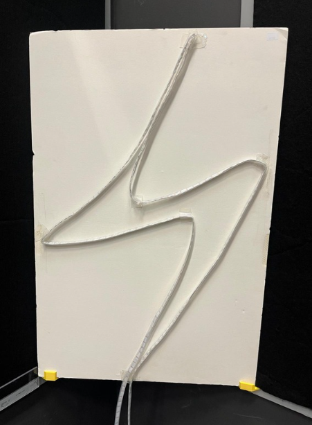
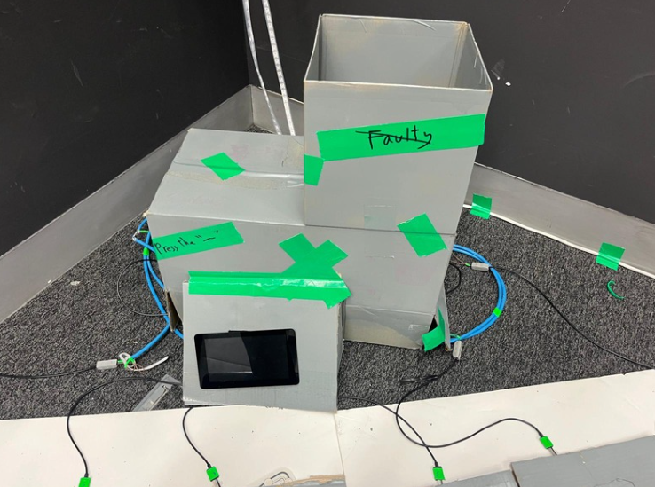
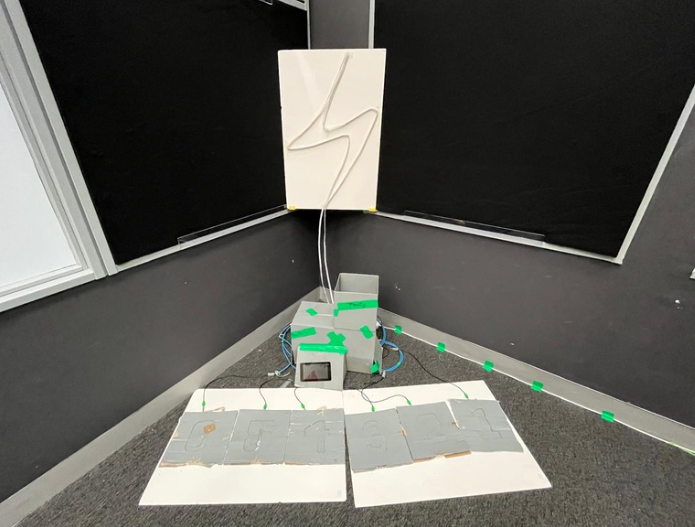

# 🎮 EGL314 – Project Documentation

## 🎯 Introduction

**Wall Glyphs: Silent Sequence** is an immersive, non-verbal multiplayer game designed for **3 to 4 players**. The objective? Collaborate **without speaking or using visual cues** to activate six glyphs on a wall in the correct order. 🤐✨

Players must rely solely on intuition and audio cues to work together and solve the sequence challenge!

---

## 🕹️ Objective

Players will:
- Observe a light-based demo of the correct glyph sequence 🔆
- Receive a **spatial audio signal** 🎧 to begin
- Step on **pressure-sensitive stones** 🪨 in the correct order
- Complete the sequence within a **set time limit** ⏱️

---

## 🔌 Dependencies

### 🛠️ Hardware
-  1x Raspberry Pi 4 Model B  
-  6x AoKu AK-399 Car Seat Pressure Sensors 
-  1x Neopixel (300 pixels) 
-  6x WAGO Connectors  
-  2x LAN cables
-  6x Carboard Button
-  1x Rasp Pi display V1
-  1x Display holder
-  1x Board (hold neopixel)
-  2x Holders for board
-  1x cardboard box to house electronics

### 💻 Software
-  Random Number Generator  
-  Sensor Signal Detector
---

## Physical connections and Props

Cabling
- 2x LAN cable

Since there are six sensors I needed twelve wires in total. I didn't want to use jumper wires as there would be too many points of failure over a long cable. I decided to use LAN cables by isolating two wires per sensor. Since a LAN cable only has four pairs and I needed six, I used two LAN cables.

Props
-  Buttons
-  Screen holder
-  Board for Neoopixel
-  Holders for Neopixel board
-  Box to house electronics

We are using cardboard to make everything. For the buttons, we layered two pieces of cardboard and carved numbers into the top two layers to create a 3D effect. I then inserted the sensor inbetween the pieces of cardboard.

For the screen holder, we used glue and cardboard to make an angled piece of cardboard with a hole for the screen. 

In our games story, we need a box to act as a power generator, we decided to use a painted cardboard box to hide our electronics.

For the Neopixel, we used nano tape to tape the neopixel to the board in a lightning pattern. We also made sure to leave some excess that could drop behind the box we are using to hide all the electronics.

Photos for reference:

<u>Buttons:</u>

We use 2 pieces of cardboard to sandwich the car seat sensor. On the top layer we carved out numbers 1 to 6. We then spray painted they grey
 
 
<u>Screen:</u>

We built a angled cardboard holder for the screen. This screen is used for the players and gamemaster to know the current state of the game
 
  
<u>Neopixel & Board:</u>

This is our Neopixel. We mounted it on the board using nano tape in a lightning shape. Its a visual aid to allow the players and audience to know how close they are to winning
 
  
<u>Box/Generator:</u>

This is the box we are using as our 'generator' and where we store our electronics. 
 
  
<u>Station 2:</u>

## 🧭 System Diagram

---
